# LearnFlow AI

> Adaptive Microlearning Engine & AI Doubt-Resolution Tutor for Mixed-Ability Classrooms

Developed by **Team AUREX** for **TetraTHON 2026 – EdTech Track**

---

## 📌 Problem Statement

**ET: Adaptive Microlearning Engine & AI Doubt-Resolution Tutor for Mixed-Ability Classrooms**

The goal of LearnFlow AI is to create an adaptive learning platform that personalizes educational content for students with different learning abilities while providing an intelligent AI-powered doubt resolution experience.

---
## 👥 Team

**Team Name:** AUREX

### Team Members

- Asmetha Thoppe
- Henisha Kandoi
- Pranav Mistry
- Harsh Chauhan
- Malav Patel

---

## 🚀 Project Overview

LearnFlow AI is an interactive EdTech platform designed to support personalized learning in mixed-ability classrooms.

The platform begins with a diagnostic assessment to understand a student's current knowledge level and then generates an adaptive learning journey. Students can practice concepts, visualize their learning progress, interact with an AI tutor, and monitor their performance through personalized dashboards.

Teachers receive classroom insights, identify weak concepts, monitor student progress, and view analytics to better support their students.

This project is currently implemented as a **frontend prototype** using realistic mock data to demonstrate the complete user experience.

---

## 📸 Screenshots

### 1. Landing Page
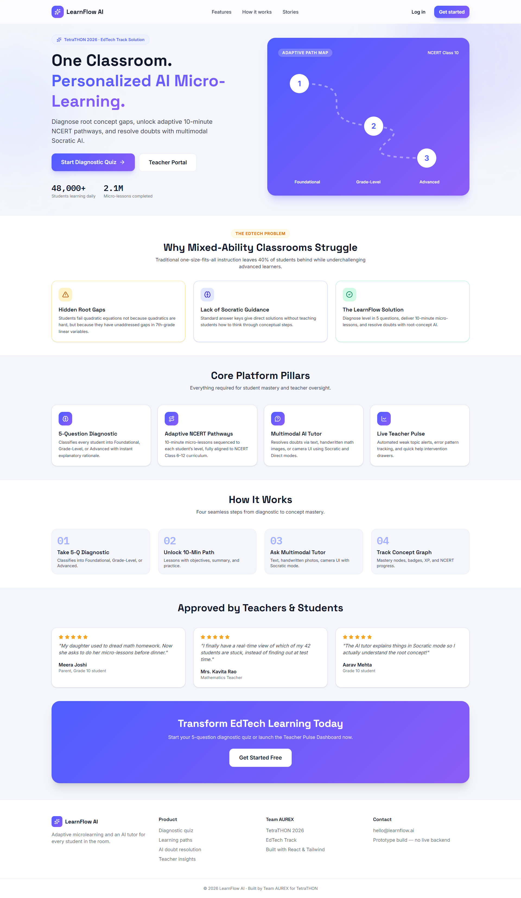

### 2. Student Login
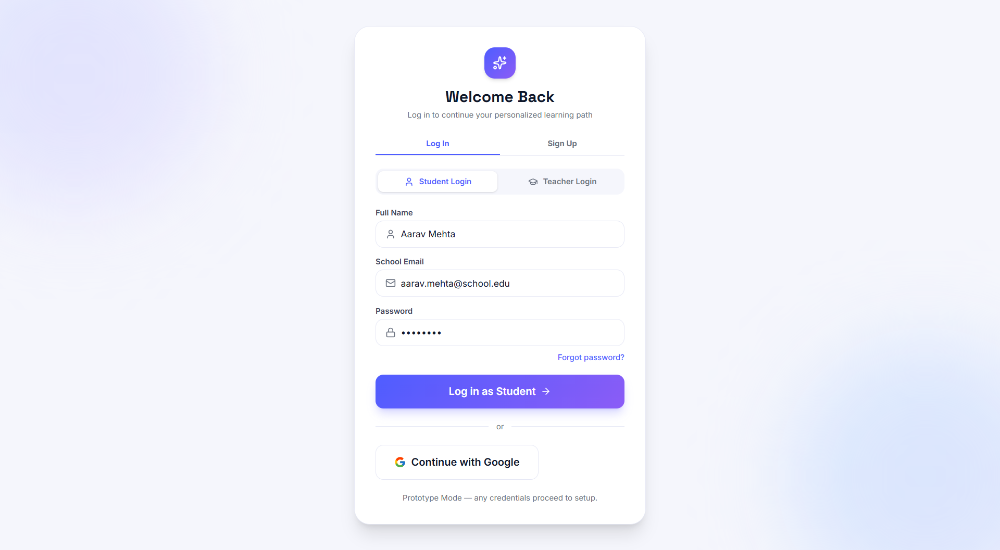

### 3. Grade & Subject Selection
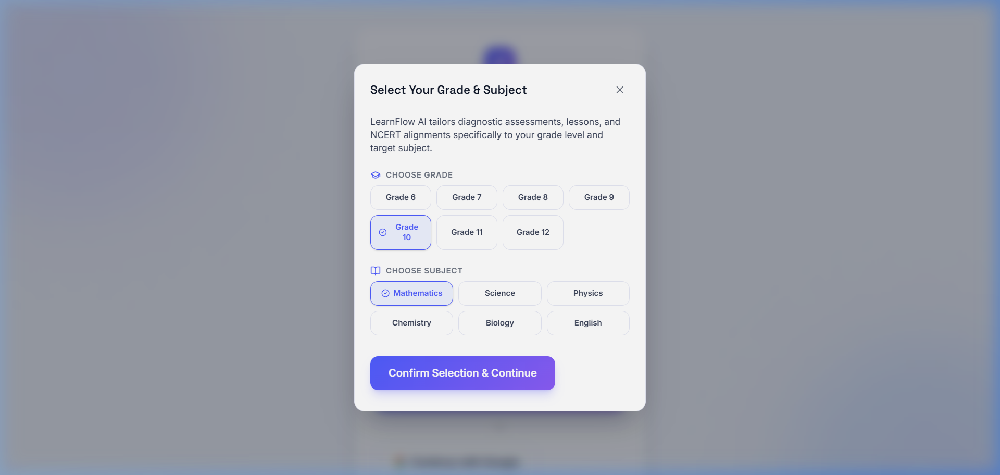

### 4. 5-Question Diagnostic Assessment
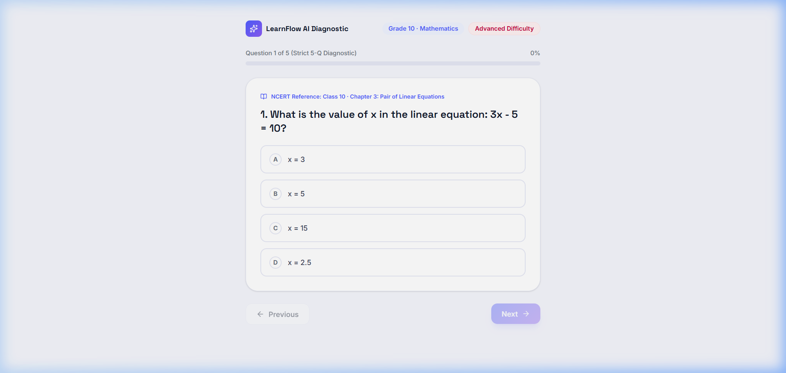

### 5. Diagnostic Result & Level Rationale
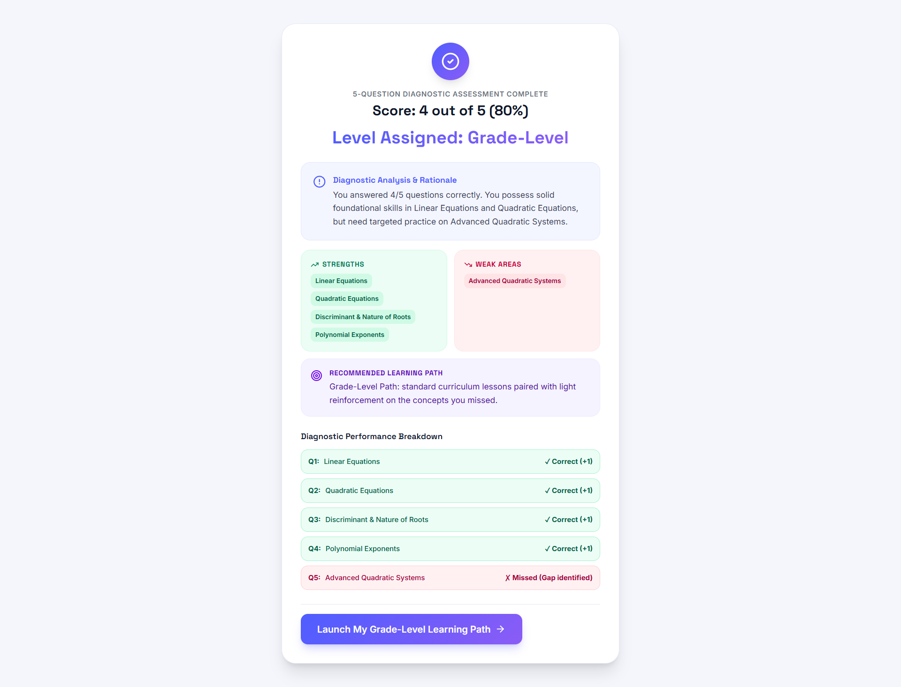

### 6. Personalized Microlearning Path
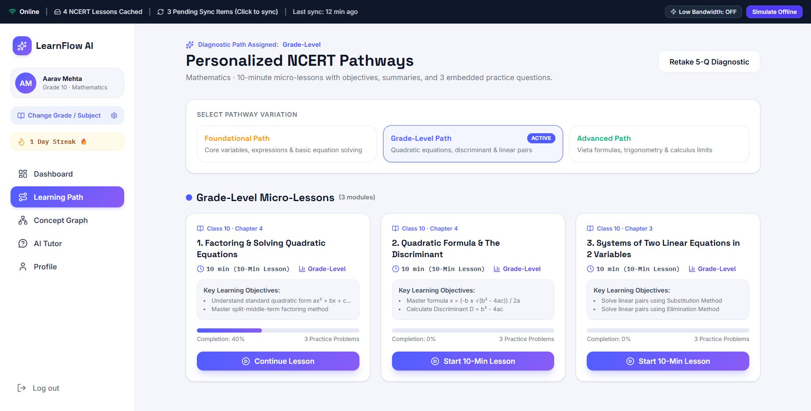

### 7. Multimodal AI Doubt Tutor (Socratic & Direct Modes)
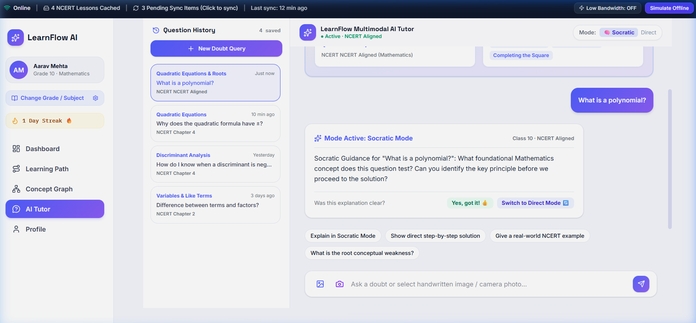

### 8. Handwritten Math Problem Photo Upload
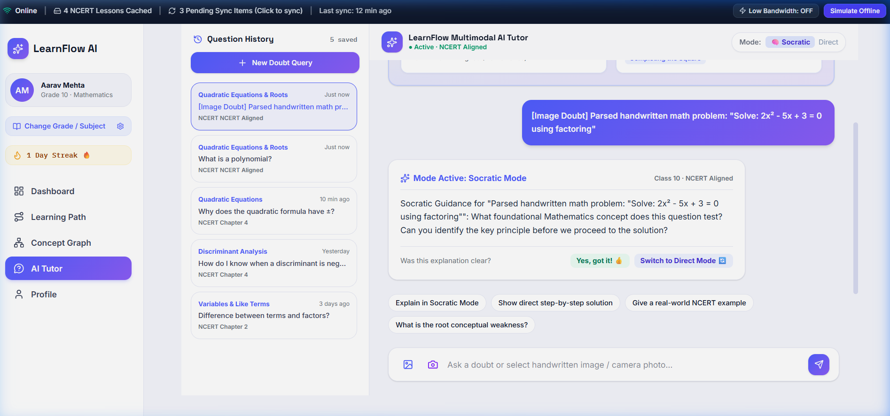

### 9. Interactive Concept Knowledge Graph
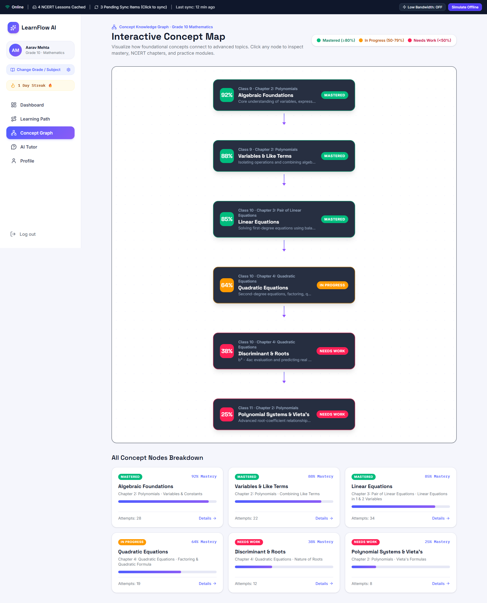

### 10. Student Progress Dashboard
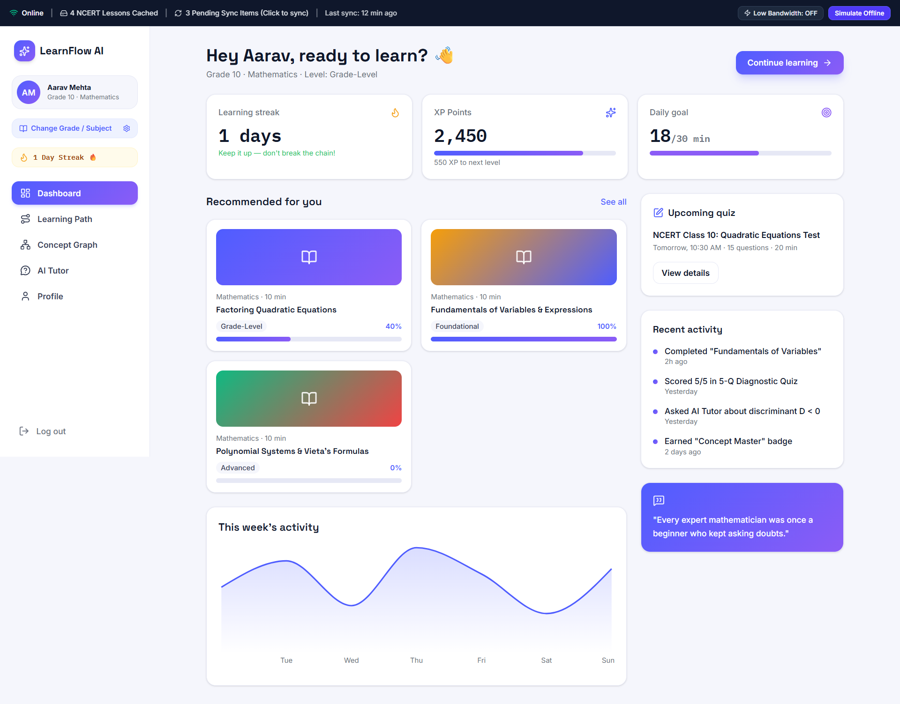

### 11. Student Session History & Activity Heatmap
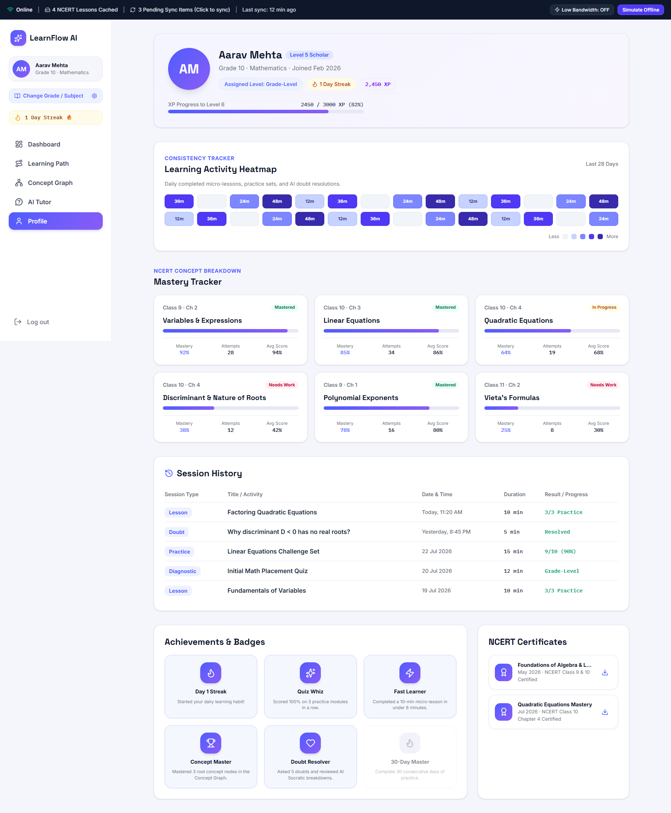

### 12. Teacher Login
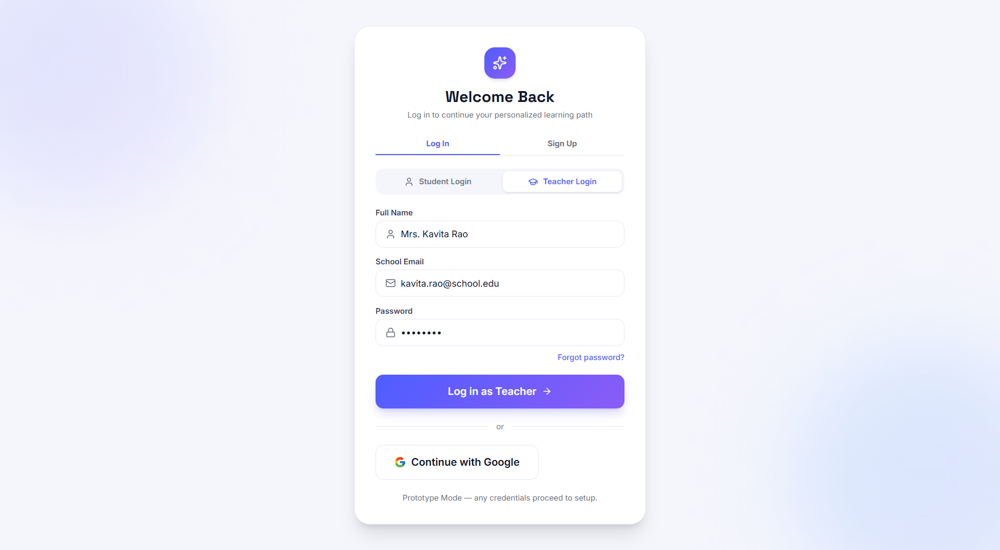

### 13. Teacher Command Center & Real-Time Pulse
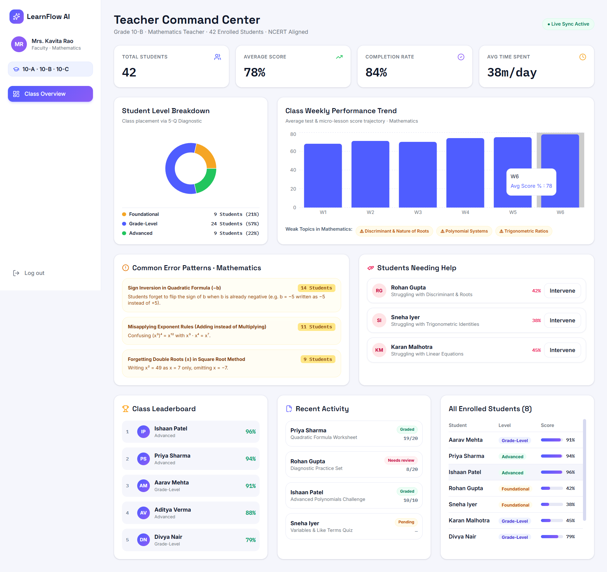

---

## ✨ Features

### 👨‍🎓 Student Module

- Landing Page
- Student Login
- Grade & Subject Selection
- Diagnostic Quiz
- Adaptive Skill Level Assignment
  - Beginner
  - Intermediate
  - Advanced
- Personalized Dashboard
- Subject-wise Learning Path
- Interactive Lessons
- AI Tutor (Simulated Responses)
- Concept Graph
- Progress Tracking
- Session History
- Student Profile
- Certificates & Achievements
- Offline Mode (UI Prototype)

---

### 👩‍🏫 Teacher Module

- Teacher Login
- Teacher Dashboard
- Student Performance Analytics
- Weak Topic Analysis
- Error Pattern Insights
- Class Progress Monitoring
- Student Leaderboard
- Recent Classroom Activity

---

## 📚 Supported Subjects

- Mathematics
- Science
- Physics
- Chemistry
- Biology
- English

Each subject contains its own:

- Learning Path
- Lessons
- AI Tutor Responses
- Concept Graph
- Progress Data
- Dashboard Content

---

## 🛠 Tech Stack

### Implemented

- React 19
- Vite
- Tailwind CSS v4
- React Router DOM
- Framer Motion
- Recharts
- Lucide React

### Planned Future Integrations

- Flask Backend
- Firebase Authentication & Database
- Gemini API

---

## 📂 Project Structure

```
src/
│
├── components/
│   ├── Reusable UI Components
│   ├── Navigation
│   ├── Progress Bars
│   ├── Timeline
│   ├── Toast
│   ├── Skeleton Loaders
│   └── Sidebars
│
├── layouts/
│   ├── StudentLayout
│   └── TeacherLayout
│
├── pages/
│   ├── Landing
│   ├── Login
│   ├── DiagnosticQuiz
│   ├── StudentDashboard
│   ├── LearningPath
│   ├── Lesson
│   ├── AiTutor
│   ├── ConceptGraph
│   ├── StudentProfile
│   └── TeacherDashboard
│
├── context/
│   └── AuthContext
│
├── data/
│   ├── mockData.js
│   └── subjectContent.js
│
└── index.css
```

---

## 🧠 Learning Flow

```
Landing Page
      │
      ▼
Login
      │
      ▼
Select Grade & Subject
      │
      ▼
Diagnostic Quiz
      │
      ▼
Adaptive Skill Level
      │
      ▼
Student Dashboard
      │
      ├────────────► Learning Path
      │                    │
      │                    ▼
      │                 Lessons
      │
      ├────────────► AI Tutor
      │
      ├────────────► Concept Graph
      │
      └────────────► Student Profile
```

Teacher Flow

```
Login
   │
   ▼
Teacher Dashboard
        │
        ├── Student Analytics
        ├── Weak Topics
        ├── Error Patterns
        ├── Classroom Performance
        └── Leaderboard
```

---

## ▶ Running the Project

Clone the repository

```bash
git clone https://github.com/Asmetha0205/AUREX-TetraTHON-2026.git
```

Install dependencies

```bash
npm install
```

Start the development server

```bash
npm run dev
```

Build the production version

```bash
npm run build
```

Preview production build

```bash
npm run preview
```

---

## 📝 Notes for Judges

- This project is a **frontend prototype** developed for TetraTHON 2026.
- All educational content is generated using realistic mock datasets.
- Student progress, quiz results, and AI conversations reset when the application is refreshed.
- The AI Tutor currently uses simulated responses to demonstrate the intended user experience.
- Diagnostic Quiz scores automatically categorize students into Beginner, Intermediate, or Advanced learning levels.
- Subject-specific dashboards and learning paths adapt based on the selected subject.

---

## 🔮 Future Scope

- Flask Backend Integration
- Firebase Authentication
- Cloud Database
- Gemini-powered AI Tutor
- Personalized Learning Recommendations
- Voice-based Doubt Resolution
- Gamification & Rewards
- Live Classroom Analytics
- Teacher Assignment Management
- Student Progress Synchronization

---

## 📄 License

This project has been developed solely for the **TetraTHON 2026 Hackathon** as an educational prototype.

---

## ⭐ Repository

If you found this project interesting, consider giving the repository a ⭐.
